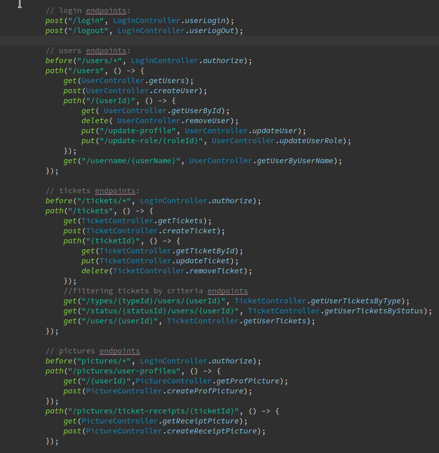
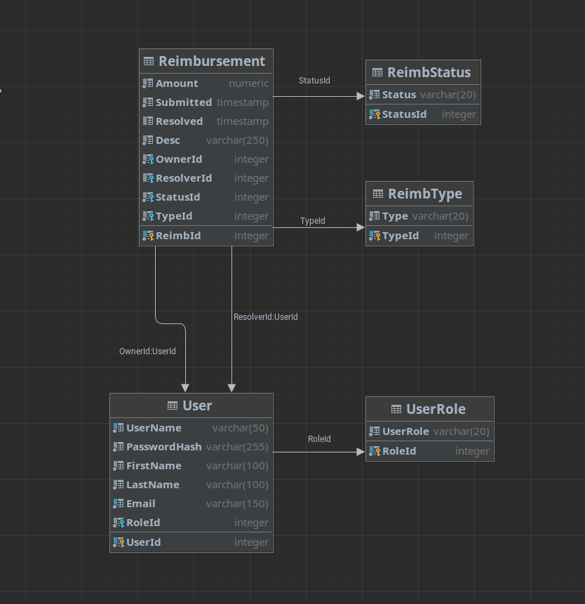

# elian_felix_p1
BankForAmericansERS

> Bank for Americans has requested us to create for them an ERS(Electronic Reimbursement System) for their employees to facilitate the work of their financial managers.

## User Stories

**As an User I would like to:**
- Sing up for an account
- Log into the system using my credentials
- Create a reimbursement ticket
  - Be able to select type (travel, lodging, food, or other)
  - Be able to se amount total
  - Be able to give a brief description
  - Be able to attach a picture of the receipt
- Look at all my created tickets
- Sort through my tickets by type or status
- Edit my profile in the system
- Add a profile picture

**As a Financial Manager I would like to:**
- View all users registered in the system
- View all tickets present in the system
- Filter through an User's tickets by status
- Filter through an User'S tickets by type
- Approve or deny a ticket
- Have processed tickets be final
- Edit Users roles

## Structural Diagrams

**API Route Structure**
 

 

**Database ERD (Entity Relationship Diagram)** 
 

 

**Use Case Diagram**
 

 

**Activity Diagram**
 

 

## Tech Stack
Technologies Stacked together to build this API:

**Main Build**
- [x] Java 8
- [x] Apache Maven
- [x] PostgreSQL (hosted on Docker)
- [x] Javalin
- [x] JJwt
- [x] Git SCM (hosted on GitHub)
- [x] Postman

**Debugging**
- [x] Logback

**Testing**
- [x] Junit

